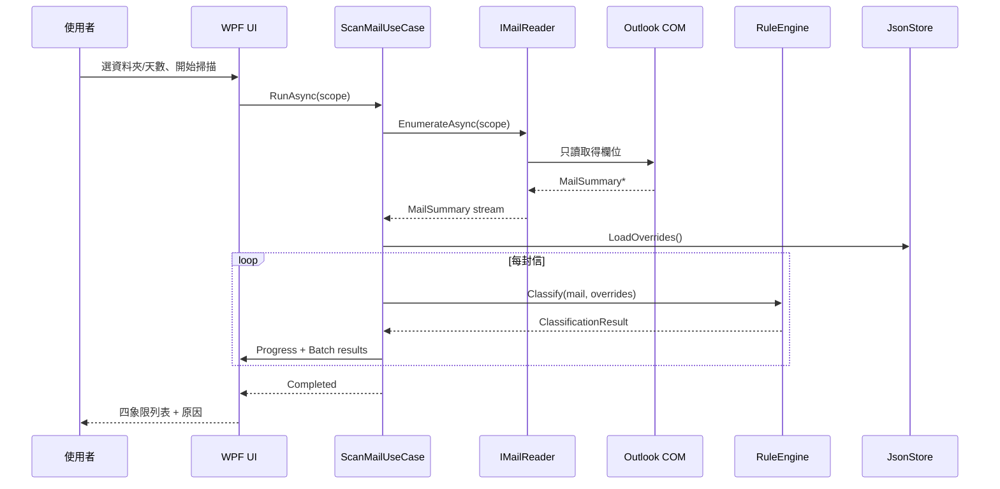

# Outlook AI 助手 — D3 Design

狀態：待使用者確認後才進入 D4 / M1 實作  
已確認決策：COM 為主 + PST 為輔；本機規則優先、AI 選擇性；使用者零安裝  
技術棧：C# / .NET Framework 4.8 + WPF + Outlook COM 後期繫結 + 本地 JSON

---

## 0. 設計順序

1. Information Architecture  
2. Interaction  
3. Components  
4. Visual Layer  

系統模組與資料模型與 UI 平行定義，但 UI 不先於 IA。

---

## 1. Information Architecture

### 1.1 主導覽（單一主視窗）

| 區域 | 職責 | 說明 |
|---|---|---|
| 側欄（左） | 一級入口 | 四象限、待回待辦、設定 |
| 工具列（上） | 範圍與動作 | 資料夾、天數、掃描、重新整理 |
| 列表（中） | 郵件或待辦清單 | 可虛擬化長清單 |
| 詳情（右） | 單筆細節 | 命中原因、手動改象限、待辦備註 |

小視窗（寬 < 1100）時：詳情改為滑出面板或全頁返回，側欄收成圖示列。

### 1.2 Screen Map

```text
MainWindow
├── QuadrantBoard（預設）
│   ├── Segment: 全部 | 緊急重要 | 緊急不重要 | 重要不緊急 | 不重要不緊急
│   ├── MailList
│   └── MailDetail
│       ├── 元資料（主旨、寄件者、時間、資料夾）
│       ├── ScoreReasonList（可解釋）
│       └── Actions（改象限、加入待辦、開啟於 Outlook）
├── TodoBoard
│   ├── Filter: 待處理 | 已完成 | 全部
│   ├── TodoList
│   └── TodoDetail / Inline edit
│       └── RelatedMails（同主旨串的所有信）
└── Settings
    ├── 掃描範圍（資料夾、天數、帳號）
    ├── 分類規則（VIP、關鍵字、權重說明）
    ├── AI（預設關、Provider、白名單欄位）
    ├── 語言（繁中 / 簡中 / English）
    ├── 隱私（資料位置、匯出、清除）
    └── 關於（版本、唯讀聲明）
```

### 1.3 導覽原則

- 三入口固定位置，不隨內容重排。  
- 四象限是預設落地頁，先看到「現在該處理什麼」。  
- 設定不進主工作流，但隱私權限在首次掃描前可到達。  
- 不做多層返回；詳情永遠可關閉回列表。

---

## 2. Interaction

### 2.1 核心流程

**掃描**

```text
使用者選範圍 → 點「開始掃描」
→ 進度（已讀 n / 上限 m，可取消）
→ 完成：列表依象限填入
→ 失敗：錯誤卡 + 重試 / 開啟設定
```

**更正分類**

```text
選一封信 → 詳情看原因
→ 「改到其他象限」
→ 寫入本地 Override（不寫 Outlook）
→ 列表立即更新；原因區顯示「手動指定」
```

**待回待辦**

```text
從郵件「加入待辦」或在 TodoBoard 手動新增
→ 標題預填主旨，可改
→ 勾完成 / 加備註 / 刪除
→ 點一列 → 右側面板顯示該待辦與「相關的郵件」（同一主旨串的所有信）
→ 相關的郵件依共用排序（§12）
→ 關閉程式後保留（JSON）
```

**AI（選擇性，預設關）**

```text
設定開啟 AI → 使用增強功能前
→ 顯示將送出的欄位白名單預覽
→ 使用者確認 → 呼叫 Provider
→ 失敗：僅關閉增強，核心分類不受影響
```

### 2.2 錯誤流

| 情境 | 使用者訊息方向 | 復原 |
|---|---|---|
| Outlook 未安裝/未啟動 | 找不到可用的 Outlook | 啟動 Outlook 後重試 |
| 無郵件帳號 | 尚未設定郵件帳戶 | 指引到 Outlook |
| COM 失敗/逾時 | 無法讀取郵件，已中止本次掃描 | 重試、縮小範圍 |
| 範圍內無信件 | 這個範圍沒有郵件 | 改天數或資料夾 |
| JSON 損毀 | 設定檔無法讀取 | 備份壞檔、重設單一檔 |
| 磁碟無法寫入 | 無法儲存待辦 | 檢查權限/空間 |
| AI 失敗 | 建議功能暫時不可用 | 核心功能仍在 |

禁止空白主畫面。任何失敗都要有：人話訊息、技術 Log、下一步動作。

### 2.3 狀態矩陣（每個資料視圖）

| 狀態 | 要求 |
|---|---|
| Empty | 說明原因 + 主行動（例如「開始掃描」） |
| Loading | 進度、可取消（長任務） |
| Error | 原因 + 重試/設定 |
| Default / Hover / Focus / Active / Selected / Disabled | 互動元件必備 |

---

## 3. Components

不先做漂亮畫面再塞功能。元件清單服務於上面的 IA/互動。

| 元件 | 用途 | 必備狀態 |
|---|---|---|
| `NavRail` | 三入口；設定齒輪在**右下角**只佔一個圖示寬（38×38），不隨 panel 撐滿 | selected / hover / focus |
| `GlassPanel` | 玻璃容器（詳情、設定卡） | default |
| `Toolbar` | 範圍 + 掃描 | disabled（掃描中） |
| `QuadrantSegment` | 象限切換 | selected 等 |
| `MailList` / `MailRow` | 郵件清單；清單上方一行摘要（共 N 封 · M 個主旨串 · K 封已加入待辦）。同一主旨串（去掉 Re:/回覆：等前綴後同主旨）合併成一列，列尾有展開箭頭，展開後每個成員各佔一列、縮排於主旨右側。**列身與箭頭分工**：點列身＝在右側面板顯示這一列代表的那封信（主旨串列就是串頭那封），點箭頭才展開／收合；列身的點擊排除勾選框、刪除鍵與箭頭本身。**排序**：預設最新在上，主旨串列以串內最新一封的時間就位，而不是以它顯示的那封 | empty / loading / error / selected / expanded |
| `MailRowBadge` | 列尾小標籤，接在象限名稱之後（例：已加入待辦；同一主旨串有多封已加入時帶數量，例：已加入待辦 2）；展開後的成員列只標自己那封是否已加入；只標狀態，不取代象限名稱 | 有／無 |
| `ScoreReasonList` | 可解釋原因 | empty |
| `QuadrantPicker` | 手動改象限 | default / confirm |
| `TodoList` / `TodoRow` | 待辦 | empty / loading / error / completed |
| `RelatedMails` | 待回待辦右側面板的「相關的郵件」區塊：列出該待辦同一主旨串的所有信，每列可點開看那一封的資訊；排序與郵件清單共用同一組設定 | empty / default |
| `TodoToolbar` | 排序 → 清除已完成 → 待辦狀態：同一列，讀序就是操作序 | default |
| `ScanProgress` | 進度 + 取消 | determinate |
| `ErrorCard` | 錯誤 + 動作 | — |
| `EmptyState` | 空狀態 | — |
| `SettingsForm` | 設定分節 | valid / invalid / saving |
| `PrivacyPanel` | 資料位置與清除 | — |
| `AiConsentDialog` | 白名單預覽 + 確認 | — |
| `PrimaryButton` / `SecondaryButton` / `GhostButton` | 動作 | 全狀態矩陣 |
| `Toast` | 輕量結果 | success / error |

約束：列表行不做重玻璃，避免可讀性下降。玻璃只用在面板與詳情層。

列表行的家具固定為三格：狀態點 → 主旨（＋副行）→ 列尾。列尾是一條橫向堆疊，依序為展開箭頭（僅主旨串列）、象限名稱、小標籤，整組靠列尾對齊、不換行。標籤只標記狀態，不搶走象限名稱的位置。主旨串列尾的標籤帶數量（該主旨串已加入待辦的封數），展開後的成員列只標自己那封是否已加入。

列身與箭頭是兩個不同的落點：箭頭只管展開／收合，列身則把這一列代表的那封信送進右側面板。收合的主旨串列也不例外——它代表串頭那封，所以收合時仍看得到串頭資訊。箭頭最小點擊高度 ≥ 44px（§9.3）。

---

## 4. Visual Layer（Design Token）

**Style anchor**  
Apple macOS / iOS 系統設定與郵件工具列的玻璃材質語彙，搬到 Windows 工具型桌面應用。不做行銷首頁、不做 AI 對話主導介面。

**Palette（Light）**

| Token | Hex | 用途 |
|---|---|---|
| `--bg` | `#F2F2F7` | 視窗底 |
| `--surface` | `#FFFFFF` | 列表/卡片底 |
| `--glass` | `rgba(255,255,255,0.72)` | 玻璃面 |
| `--glass-stroke` | `rgba(255,255,255,0.55)` | 玻璃高光邊 |
| `--ink` | `#1C1C1E` | 主文字 |
| `--ink-muted` | `#6C6C70` | 次要文字 |
| `--separator` | `rgba(60,60,67,0.12)` | 分隔線 |
| `--accent` | `#0A84FF` | 主操作 |
| `--danger` | `#FF3B30` | 錯誤 |
| `--q1` | `#FF453A` | 緊急重要 |
| `--q2` | `#FF9F0A` | 緊急不重要 |
| `--q3` | `#0A84FF` | 重要不緊急 |
| `--q4` | `#8E8E93` | 不重要不緊急 |

**Palette（Dark）**

| Token | Hex |
|---|---|
| `--bg` | `#000000` |
| `--surface` | `#1C1C1E` |
| `--glass` | `rgba(28,28,30,0.72)` |
| `--glass-stroke` | `rgba(255,255,255,0.12)` |
| `--ink` | `#F2F2F7` |
| `--ink-muted` | `#98989D` |
| `--separator` | `rgba(84,84,88,0.6)` |
| `--accent` | `#0A84FF` |
| 象限色 | 同 Light，必要時加亮 |

**Typography**

| Role | Family | Size / Weight |
|---|---|---|
| Title | `Segoe UI Variable Display`, `Segoe UI Semibold`, `Microsoft JhengHei UI` | 22 / 600 |
| Body | `Segoe UI Variable Text`, `Segoe UI`, `Microsoft JhengHei UI`, `Microsoft YaHei UI` | 14 / 400 |
| Caption | 同上 | 12 / 400 |
| Mono | `Cascadia Mono`, `Consolas` | 12 / 400 |

中文優先微軟正黑/雅黑 UI 字型；不用外部字型檔（零安裝）。

**Spacing / Radius / Elevation**

- 基準 4px：4 / 8 / 12 / 16 / 24 / 32  
- Radius：control 8、panel 12、sheet 16  
- Elevation：玻璃面板用 blur + 細邊，不用重陰影  

**Motion**

- 僅列表插入、面板開合、進度，≤ 200ms  
- 尊重 `prefers-reduced-motion`（WPF 側以系統動畫設定或等價開關）  
- 禁止裝飾性持續動畫  

**Glass 實作原則（WPF）**

- 背景：半透明填充 + 系統 DWM blur（可用時），不可用時退化為純半透明面 + 描邊  
- 對比：玻璃面上正文對比 ≥ 4.5:1  
- 列表列、長文、原因文字落在實心 `--surface` 或足夠遮罩，不落在強模糊區  

**UI 不能有 AI 味**

- 不用機器人圖示、不用對話氣泡當主 UI、不用「智能為您…」文案  
- AI 僅在設定與選擇性對話框出現，動詞清楚  

---

## 5. System Architecture

```text
┌─────────────────────────────────────────────┐
│ UI (WPF)                                    │
│  QuadrantBoard / TodoBoard / Settings       │
└──────────────────┬──────────────────────────┘
                   │ ViewModel / 用例呼叫
┌──────────────────▼──────────────────────────┐
│ Application                                 │
│  ScanMailUseCase                            │
│  ClassifyUseCase                            │
│  TodoUseCase                                │
│  SettingsUseCase                            │
└───────┬──────────────────────────┬──────────┘
        │                          │
┌───────▼────────┐        ┌────────▼─────────┐
│ Core Domain    │        │ AI Capability    │
│ RuleEngine     │        │ Interface        │
│ Quadrant       │        └────────┬─────────┘
│ Todo model     │                 │
│ Override       │        ┌────────▼─────────┐
└───────┬────────┘        │ Provider Adapter │
        │                 │ (optional)       │
┌───────▼────────┐        └────────┬─────────┘
│ Adapters       │                 │
│ Outlook COM    │        ┌────────▼─────────┐
│ JsonStore      │        │ Provider API     │
│ Logger         │        └──────────────────┘
└────────────────┘
```

### 5.1 模組邊界

| 模組 | 依賴 | 禁止 |
|---|---|---|
| `Core` | 無 UI、無 COM、無 AI、無磁碟 | 不引用 WPF / Outlook / HTTP |
| `Application` | Core + 介面（Port） | 不直接 `new` COM 物件 |
| `Adapters.Outlook` | COM | 不寫回郵件（M1–M3） |
| `Adapters.Storage` | JSON 檔 | 不存 Token / 信件內文（Log 同理） |
| `Adapters.AI` | HTTP（可選） | 不得讓例外潰到 UI 崩潰 |
| `UI` | Application + Core 型別 | 不寫業務規則 |

### 5.2 外部依賴

- OS：.NET Framework 4.8、Outlook 桌面、DWM（可選玻璃）  
- 人為：使用者設定的 AI Endpoint（可選）  
- 本專案 MVP 不引 NuGet 套件  

### 5.3 平台抽象與擴充點

| 介面 | 目的 | MVP 實作 |
|---|---|---|
| `IMailReader` | 讀郵件 | `OutlookComMailReader` |
| `IMailArchiveImporter` | PST 匯入 | `PstImportReader`（可 M2） |
| `IOverrideStore` / `ITodoStore` / `ISettingsStore` | 持久化 | `JsonStore` |
| `IClassifier` | 分類 | `RuleEngine` |
| `IAiCapability` | 增強 | `NullAiCapability` + 可選 HTTP adapter |

換 AI 廠商只動 `Provider Adapter`。換儲存只動 Storage adapter。Core 不變。

---

## 6. Data Flow

### 6.1 掃描與分類



**掃描範圍**

- 遞迴走訪所有郵件儲存區（主要信箱 + 封存 PST）中的郵件資料夾。
- 一律排除「刪除的郵件」資料夾及其子資料夾：各儲存區以 `GetDefaultFolder(olFolderDeletedItems)` 的 EntryID 判定，資料夾被改名仍可辨識；另以資料夾名稱（繁中／簡中／英文）作為備援判定。
- 天數：只取 `ReceivedTime` 在 N 天內的郵件。
- 上限：單次掃描最多 2000 封。

### 6.2 唯讀原則

- COM 只呼叫取得屬性/資料夾列舉。  
- 不呼叫 `MarkAsRead`、`Move`、`Flag`、`Save`、`Send`。  
- 「開啟於 Outlook」用 EntryID 以 Inspector 顯示，仍不改內容。  
- 本地 Override / Todo 與 Outlook 郵件屬性分離存放。

### 6.3 更新機制

版本單一來源：repo 根目錄 `VERSION`（例：`1.0.0`）。`build.ps1` 讀取後蓋入組件的 `AssemblyInformationalVersion`，App 以 `AppInfo` 回報，GitHub Release 的標籤與產物名稱用同一個號碼，三者不會漂移。

- 檢查：`CheckForUpdateUseCase` 經由 `IReleaseFeed`（實作 `GitHubReleaseFeed`，讀 `releases/latest`）取得最新版本；`AppVersion` 比較現行版與標籤（接受 `v1.2.3`、忽略 build metadata、拒絕 prerelease 與格式錯誤的標籤）。
- 決策物件：`UpdateOffer` / `UpdateStatus`（`UpToDate`、`UpdateAvailable`、`NotPublished`、`Failed`）。UI 只呈現結果，不做任何判斷。
- 確認：`UpdateSheet` 以 Apple/macOS 語彙的 modal sheet 呈現（標題、版本對照、版本說明、主要按鈕「下載並更新」、次要「稍後」、文字鈕「開啟下載頁面」）。按下主要按鈕前不會發出任何下載。
- 安裝：`UpdateInstaller` 下載至 `%TEMP%` → 驗證 → 產生批次腳本 → 程式結束後替換 exe 並重新啟動。安裝前先做寫入探測，程式所在資料夾不可寫（如 Program Files）時改為只提供下載頁面。
- 啟動時檢查為選項（設定頁「啟動時自動檢查更新」），預設關閉；失敗只寫入 log，不打擾使用者。

資安邊界（全部集中在 `Core/Security/UpdateSecurityPolicy.cs`，可用單元測試驗證）：

- 僅 HTTPS，且主機須在 GitHub 白名單（`github.com`、`api.github.com`、`objects.githubusercontent.com`、`github-releases.githubusercontent.com`、`release-assets.githubusercontent.com`）；主機為精確比對、不做後綴比對（避免 `github.com.evil.example` 這類混淆網域），禁自訂埠、禁網址內帳密，重導後的最終位址需再通過同一檢查。`release-assets.githubusercontent.com` 是實際觀察到下載重導的資產主機；若 GitHub 之後改用別的主機，行為是「拒絕下載」而非信任未知主機（fail closed）。
- 檢查與下載共用同一個 TLS 進入點（`UpdateHttp.EnsureModernTls`，冪等）：程序預設的 `Ssl3|Tls` 會被 GitHub 的 API 與資產主機拒絕；兩者共用可避免「下載只有在同一程序先做過檢查時才成功」的隱性順序相依。
- 只接受資產名稱 `OutlookAiHelper.exe`（純檔名、非路徑）、大小上限 200 MiB，且實際位元組數需與 Release 宣告相符。
- 下載內容需具 Windows 執行檔（MZ）檔頭，不符即刪除暫存檔並中止。
- 批次腳本中的路徑需通過 `IsSafeForUpdaterScript`（擋 `"`、`%`、`&`、`|` 等 cmd 特殊字元），避免指令注入。
- 更新路徑只對 GitHub 發出 GET；不送出任何本機資料、API key 或信件內容。

對應檔案：`Core/Models/AppVersion.cs`、`AppInfo.cs`、`ReleaseInfo.cs`、`UpdateOffer.cs`；`Core/Security/UpdateSecurityPolicy.cs`；`Core/Abstractions/IReleaseFeed.cs`；`Core/Application/CheckForUpdateUseCase.cs`；`Adapters/Update/GitHubReleaseFeed.cs`、`UpdateInstaller.cs`、`UpdateHttp.cs`；`UI/UpdateSheet.cs`、`UI/MainWindow.Update.cs`；`tests/UpdateTests.cs`；`VERSION`；`release.ps1`（建置 → 標籤 → 發佈產物的發佈腳本）。

---

## 7. Data Model

### 7.1 Entities

```text
MailSummary
  EntryId, FolderPath, Subject, FromName, FromAddress,
  ReceivedOn, IsRead, HasFlag, IsMeetingRequest, Importance

ScoreReason
  Code, LabelKey, Delta, Detail

ClassificationResult
  EntryId, Quadrant (Q1..Q4), Score, Reasons[]

Override
  EntryId, Quadrant, UpdatedOn, Source = Manual

TodoItem
  Id, Title, Note, SourceEntryId?, QuadrantHint?,
  Status (Open|Done), CreatedOn, UpdatedOn, DueOn?

AppSettings
  SchemaVersion, Language, FolderScope[], ScanDays,
  VipAddresses[], UrgentKeywords[], ImportantKeywords[],
  AiEnabled, AiProviderConfig? (無金鑰明文；Key 另存 user DPAPI/檔且權限最緊)
```

### 7.2 象限定義（可解釋起點）

預設權重（可在設定調整，必須顯示目前權重）：

| 訊號 | 預設效果 |
|---|---|
| 主旨/內文前 500 字含緊急詞（今天、盡快、ASAP、urgent…） | 緊急 + |
| 會議邀請、工作階段邀請 | 緊急 + |
| 未讀且「直接寄給我」 | 緊急 + 小 |
| VIP 寄件者 | 重要 + |
| 重要詞（合約、付款、客訴、報價…） | 重要 + |
| 寄件者在忽略清單 | 重要 − |
| 本地 Override | 最終象限以此為準，不重算 |

象限閾值：緊急分 ≥ `U` 且重要分 ≥ `I` → Q1，依此類推。  
`ScoreReason` 必須能指出每一條加減分，UI 原文顯示（i18n key）。

### 7.3 Storage Schema（JSON）

路徑：`%LOCALAPPDATA%\OutlookAiHelper\`（不寫系統目錄；可改到使用者資料夾）

| 檔 | 內容 | 預設保存 |
|---|---|---|
| `settings.json` | AppSettings | 直到使用者刪除/重設 |
| `overrides.json` | Override[] | 直到刪除或「清除本地分類記憶」 |
| `todos.json` | TodoItem[] | 直到刪除或匯出後清除 |
| `cache\scan-index.json` | 上次掃描摘要（無內文） | 可清除；可設 TTL 30 天 |
| `logs\app-YYYYMMDD.log` | 技術 Log | 滾動保留 7 天 |
| `exports\` | 使用者匯出 | 使用者自管 |

每個 JSON 有 `schemaVersion`。破壞性變更走 `Migrate(from → to)`；無法讀取時把壞檔改名 `*.bad-YYYYMMDD` 再重建，不直接靜默覆寫。

**資料最小化對照**

| 資料 | 為何需要 | 用在哪 | 存多久 | 誰存取 | 可刪 |
|---|---|---|---|---|---|
| 主旨/寄件者/時間 | 分類與列表 | UI/規則 | 快取可清；核心不長期存內文 | 僅本機使用者 | 是 |
| 內文前綴 | 關鍵字 | 僅記憶體分類 | 不落盤（除非使用者開診斷且明示） | 僅本機 | 是 |
| Override | 你的更正 | 分類覆寫 | 使用者可控 | 僅本機 | 是 |
| Todo | 待回待辦 | 待辦頁 | 使用者可控 | 僅本機 | 是 |
| AI 請求 | 選擇性增強 | Provider | 不預設本地保存請求體 | 你 + Provider | 不適用（已送出） |

---

## 8. Directory Structure

```text
outlook-ai-helper/
  DESIGN.md
  README.md
  src/
    OutlookAiHelper/
      OutlookAiHelper.csproj
      App.xaml
      App.xaml.cs
      Core/
        Classification/
          Quadrant.cs
          ScoreReason.cs
          ClassificationResult.cs
          RuleEngine.cs
          RuleOptions.cs
        Models/
          MailSummary.cs
          TodoItem.cs
          Override.cs
        Abstractions/
          IMailReader.cs
          IClassifier.cs
          IOverrideStore.cs
          ITodoStore.cs
          ISettingsStore.cs
          IAiCapability.cs
      Application/
        ScanMailUseCase.cs
        ClassifyUseCase.cs
        TodoUseCase.cs
        SettingsUseCase.cs
      Adapters/
        Outlook/
          OutlookComMailReader.cs
          OutlookAvailability.cs
        Storage/
          JsonStore.cs
          JsonPaths.cs
          SchemaMigrations.cs
        Ai/
          NullAiCapability.cs
        Logging/
          FileLogger.cs
      UI/
        MainWindow.xaml
        Views/
        ViewModels/
        Controls/
        Converters/
        Themes/
          Tokens.xaml
          Light.xaml
          Dark.xaml
      Localization/
        Strings.zh-TW.resx
        Strings.zh-CN.resx
        Strings.en-US.resx
  tests/
    OutlookAiHelper.Tests/
      RuleEngineTests.cs
      TodoStoreTests.cs
      MigrationTests.cs
```

---

## 9. UI / UX Plan

### 9.1 布局草圖

```text
┌────────┬──────────────────────────────────────────────┐
│ 四象限  │ [資料夾 ▾][天數 ▾] [開始掃描] [重新整理]      │
│ 待回待辦├──────────────────────────────────────────────┤
│ 設定   │ [全部|Q1|Q2|Q3|Q4]                           │
│        ├────────────────────────────┬─────────────────┤
│        │ 郵件列表                    │ 詳情             │
│        │ · 主旨 / 寄件者 / 時間      │ 主旨            │
│        │ · 象限點                    │ 原因列表        │
│        │ · …                         │ [改象限][待辦]  │
└────────┴────────────────────────────┴─────────────────┘
```

### 9.2 主路徑（非技術使用者）

1. 開啟程式 → 看到四象限空狀態：「先掃描收件匣」  
2. 預設資料夾=收件匣、天數=30 → 開始掃描  
3. 依 Q1 先處理；點一筆看「為什麼」  
4. 改錯分類；加一條待回  
5. 到待回待辦勾完成  

首次啟動顯示一次唯讀聲明（可關閉，設定可再看）。

### 9.3 視覺層執行對照

- 全部顏色/字級只從 `Tokens.xaml` 來，頁面不自創 hex  
- Light/Dark 跟隨系統，設定可強制  
- 文案全部走 `t(key)`，含錯誤、空狀態  
- 對比與鍵盤焦點照 Apple HIG；點擊目標用**桌面**數值，不套觸控的 44px 規則。實測：側邊欄文字列 186×38、圖示鈕 28×28、設定齒輪 38×38（另給 `ToolTip` 與 `AutomationProperties.HelpText`），可點區域遠大於指標所需  
- 每個可操作控制項都有可讀名稱（`AutomationProperties.Name`）：圖示按鈕、清單列（列用 `UiKit.FlatListItemStyle("Content.Tag.…")` 綁定自身內容）、以及設定頁每個輸入框與下拉選單（`WithName(…)`）。少了它，輔助工具只唸出容器型別或一個空字串  

### 9.4 Design pass 摘要

```text
SUBJECT   本機 Outlook 四象限與待回清單 — 信任感與可掃讀
COLOR     --bg #F2F2F7 / --ink #1C1C1E / --accent #0A84FF
          象限色 q1 #FF453A q2 #FF9F0A q3 #0A84FF q4 #8E8E93
TYPE      Segoe UI Variable + Microsoft JhengHei UI（系統字）
          標題 22/600，本文 14/400，說明 12
LAYOUT    傳統三欄工作區（導覽 | 列表 | 詳情），密度偏工具不偏卡片牆
SIGNATURE 象限板上的玻璃面板 + 象限色點；列表列保持實心可讀
RISK      玻璃不進密列表列；不用漸層濫用、不用吉祥物/AI 對話殼
```

---

## 10. Test Strategy

| 層級 | 對象 | 方法 | 驗收 |
|---|---|---|---|
| 單元 | RuleEngine | 純 C#，表格驅動關鍵字/VIP/Override | 覆蓋邊界與空輸入 |
| 單元 | JSON 遷移 | 壞檔、舊版 schemaVersion | 不靜默遺失 |
| 單元 | TodoUseCase | 新增/完成/刪除 | 狀態正確 |
| 整合 | ScanMailUseCase | `IMailReader` 假實作 | 可取消、批次、錯誤 |
| 手動 | Outlook COM | 真實 2016/2019/2024/O365 至少兩種 | 唯讀、千封、關 Outlook |
| 手動 | UI 三態 | 斷網/空/錯 | 無空白頁 |
| 手動 | i18n | 切三語 | 錯誤與空狀態也翻 |
| 隱私 | Log/快取 | 搜尋內文關鍵字、Token | 應為 0 |

M1 不把「真實 Outlook 自動化測試」當閘門，先用 Fake 鎖規則，再手動驗證 COM。

---

## 11. Milestone Plan

| 里程碑 | 目標 | 含 | 不含 |
|---|---|---|---|
| **M1** | 唯讀掃描 + 可解釋四象限 | COM 讀取、RuleEngine、四象限 UI、三態、手動改象限、基礎 i18n | 待辦持久化、PST、AI、匯出 |
| **M2** | 待回待辦 + Override 持久化 | todos.json、覆寫持久化、從郵件加待辦 | 自動待辦生成 |
| **M3** | 設定、隱私、匯出/清除 | 設定頁、隱私面板、匯出 JSON | 云同步 |
| **M4** | 可選 AI 增強 | Provider Adapter、白名單預覽、可切換 | 建議回覆（FUTURE） |

依序交付；每個里程碑都要能走完「進入 → 核心任務 → 結果 → 錯誤」。

---

## 12. 已對齊決策（2026-09-24）

| 決策 | 內容 | 標籤 |
|---|---|---|
| 關鍵字 | 以**標題（主旨）**比對為主；專案內建預設詞 + 使用者可設定關鍵詞辨識緊急/重要 | [DECISION] |
| 掃描天數 | 預設 30 天，使用者可調整 | [DECISION] |
| 建置環境 | 本機無 MSBuild、無 .NET SDK；有 .NET Framework 4.8 + `csc.exe`。以 `build.ps1` 呼叫 csc 編譯 | [DECISION] |
| UI 實作 | 因無 XAML 編譯管線，WPF 以程式碼建構視窗/元件（玻璃視覺仍依 Token） | [DECISION] |
| 序列化 | 不用第三方 JSON；採 BCL `DataContractJsonSerializer` | [DECISION] |
| 測試 | 不引 NUnit；輕量 `TestRunner` 命令列斷言，`test.ps1` 執行 | [DECISION] |
| 郵件清單列身 | 點列身＝右側面板顯示該列代表的那封信（收合的主旨串列＝串頭那封）；只有列尾箭頭展開／收合 | [DECISION] |
| 郵件排序 | 一組共用排序設定（郵件清單與待辦面板的相關郵件共用）：預設「最新在上」，另有最舊在上、依象限、依寄件者、依主旨 | [DECISION] |
| 相關的郵件 | 待辦面板列出同一主旨串（去掉 Re:/回覆：等前綴後同主旨）的所有信 | [DECISION] |

### 12.1 主旨關鍵字（可設定）

比對範圍：主旨（M1）。詞表可在設定檔 `RuleOptions` 調整。

- 緊急預設：`緊急` `急` `盡快` `立刻` `馬上` `今天` `ASAP` `urgent` `immediate` `deadline` `到期` `截止`  
- 重要預設：`專案` `project` `合約` `報價` `付款` `發票` `客訴` `投訴` `簽核` `核准` `會議` `合約` `報價` `付款` `invoice` `contract` `quote` `approval` `complaint`  

命中即加對應分；可多詞累加有上限。VIP 寄件者仍計入重要分。
